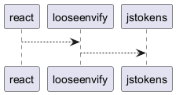

## ДЗ 2

> Инструмент командной строки для визуализации графа зависимостей пакета языка JavaScript. Для описания графа зависимостей используется представление PlantUML.

>Ключами командной строки задаются: путь к программе для визуализации графов, имя анализируемого пакета, путь к файлу с изображением графа зависимостей, максимальная глубина анализа зависимостей.

Все функции визуализатора зависимостей покрыты тестами.

В вашей системе должен быть установлен менеджер пакетов npm.

Пример работы визуализатора для пакета react:
